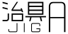

# JIG-A

## 概要

### 特徴

本リポジトリは**JavaScriptが動作するブラウザがあれば、環境・状況を選ばず動作する**ことを目的とし、下記の特徴を持ちます。

#### デバイスを選ばない

モバイル・デスクトップ端末両方で利用できるようします。

#### 接続状況を選ばない

オフラインでも動作するようにします。

そのため 単一の `html` 内にスタイル・スクリプト等を詰めた自己完結的なファイルを別途用意します。ローカル上にこのファイルを保存することで、オフラインでも利用できることを想定しています。

#### 人を選ばない

簡素な設計に留め、利用者側に合ったデザインになるようします。

OS側が持つ フォントサイズ や カラーモード 情報を拾う、可変性のあるデザインとなっています。またマシンリーダブルな構造や WAI-ARIA を使いキーボードやスクリーンリーダーでも利用できるようすることを目指しています。

## 利用について・ライセンス

本リポジトリは様々な形で利用できるよう設計しております。ローカル上に保存して使ったりと、基本的に自由に利用していただいて構いません。

ただし、下記の 2 点についてご了承ください。

1. 著作権は放棄していません、これを偽るような利用はお辞めください
2. 利用で生じる何かしら（不利益含む）に対し、著作者は責任を負うことはできません

いろんな環境や状況で利用できるよう設計してますが、検証ができてるわけではないので不具合等が想定されます。利用の際には、ご自身で試していただき、ご自身の責任でご利用ください。

誤り等は issue を通して連絡いただければ助かります。ケースによっては対応に時間がかかることが想定されます、ご了承いただければ幸いです。

### ライセンスについて

本リポジトリは[MITライセンス](./LICENSE)となっています。

なお、本リポジトリは下記を使用しております。

#### `normalize.css`

ノーマライズCSSとして、[Normalize.css](https://necolas.github.io/normalize.css/)を使用しています。こちらは[MITライセンス](https://github.com/necolas/normalize.css/blob/master/LICENSE.md)となっています。
